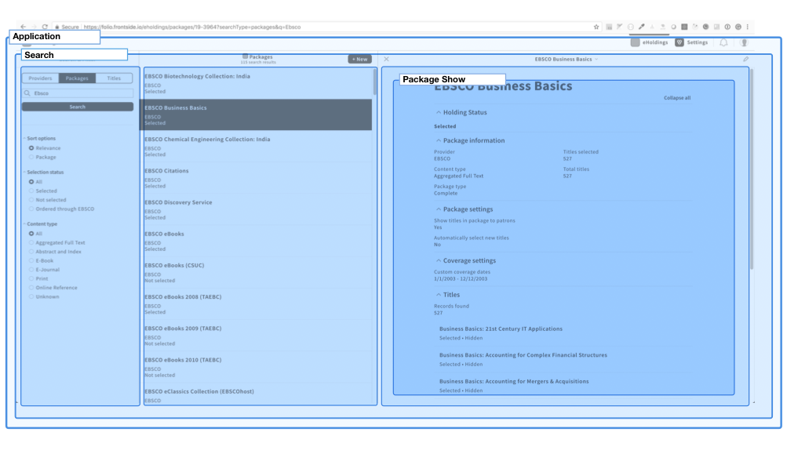
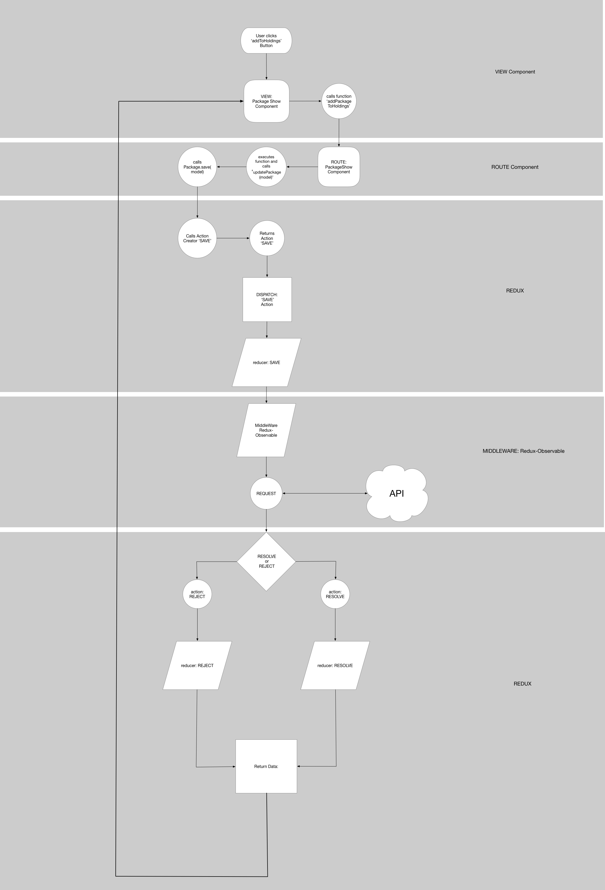

# Routing Architecture

## Intro

The URL is the basis for routing in `ui-eholdings`. URL stands for Universal Resource Locator or Uniform Form Resource Locator. It has been a fundamental part of the Web a few years after its inception. But as years past and Javascript had its phoenix-like rebirth back to the Web. This brought along Javascript Single Page Applications (SPA's). Single Page Applications can choose to deal with the URL in two ways.

First way, expose only one "entry" into the application which is likely the root `/`. This is limiting as any access or navigation to a location in the application has to start from the root. So, a user couldn't give another user a specific location in the app and have it render. They would have give a list of directions starting from the root. Detailing every click needed to get back to that location in the app. This is great for driving directions in your car not so much with a web application.

The second method, is to allow the application to render to any location based on the URL. Conveniently named location-based SPA's. So rather than getting a list of directions you get a URL which is like a coordinate to the app. The app will use this URL to render the location the user requested. Think of it as being able to teleport in your car to any location rather than driving.

The second options provides powerful mechanisms such as:

- Sharing
- Navigation
- Collaboration
- Bookmarking
- Embedding
- Linking

This is the essence of the Internet. These functionalities make Web applications a beautiful experience for users.

## URLs in a application

URLs are the main entry way into your app. A user can get a URL in the app by either navigating to a location or pasting a given URL into the browser's address bar. The application will decompose the URL and use that information for its routing.

Let's use this URL for example:

`https://folio.frontside.io/eholdings/packages/19-3964?searchType=packages&q=Ebsco`

Single Page Applications generally make use of `window.location` to aid in decomposition of the URL. The above URL will decompose to an location object similar to:

```javascript
location = {
  protocol: https,
  hostname: 'folio.frontside.io',
  pathname: 'eholdings/packages/19-3964',
  search: '"?searchType=packagess&q=Ebsco"',
  hash: ''
}
```

Stripes and ui-eholdings use React Router v4 at the time of this writing. Using React Router you also get access to a `match` object which contains information used by `<Route />`'s path for matching the path:


Looking at the `match` object from within a Route Component after a match is made you would see something like this.

```javascript
match = {
  path: 'eholdings/packages/:packageId'
  url: 'eholdings/packages/19-3964'
  isExact: true,
  params: {}
}
```

The Router will then use the information in this location object for Route Matching.

## Folder structure

Routes and View Components are seperated in `ui-eholdings`. Routes are in the `routes` folder. Views are in `src/components` directory.

## Routers & Routing

Routers are made up of Routes and Applications are a composition of Routes. The definitions and in turn composition of the routes usually happen in a one file. This one file predefines all the routes of the application. In ui-eholdings they are defined within `src/index.js`. The Router uses the Routes to match the pathname from the location object (URL) to a `path` of a specific Route.

One caveat to mention. React Router v4 describes its self as doing "dynamic routing" as oppose to a "static routing". Dynamic Routing to React Router mean routing takes place as your app is rendering, not in a configuration file that is statically analyzed before your application is rendered. So even though the Routes are defined in one file React Router is "dynamic" out the box.

Defining a Route looks like this:
``<Route path={`${rootPath}/packages/:packageId`} exact component={PackageShow}>``
The path can be static `${rootPath}/packages/new` or dynamic `${rootPath}/packages/:packagesId`. The leading colon denotes that the expected value can be unique every time. The `component` prop in the Route is declaring which component should be returned when the path matches. In the case of `ui-eholdings` that would return a "Route" component.

Here is the Route definitions from `src/index.js`.

 ```javascript
 ...

  render() {
    let {
      showSettings,
      match: { path: rootPath }
    } = this.props;

  return showSettings ? (
      <Route path={rootPath} component={SettingsRoute}>
        <Route path="knowledge-base" exact component={SettingsKnowledgeBaseRoute} name="Knowledge base" />
        <Route path="root-proxy" exact component={SettingsRootProxyRoute} name="Root proxy" />
        <Route path="custom-labels" exact component={SettingsCutomLabelsRoute} name="Custom labels" />
      </Route>
    ) : (
      <Route path={rootPath} component={ApplicationRoute}>
        <Route path={`${rootPath}/:type?/:id?`} component={SearchRoute}>
          <Switch>
            <Route path={`${rootPath}/providers/:providerId`} exact component={ProviderShow} />
            <Route path={`${rootPath}/packages/new`} exact component={PackageCreate} />
            <Route path={`${rootPath}/packages/:packageId`} exact component={PackageShow} />
            <Route path={`${rootPath}/packages/:packageId/edit`} exact component={PackageEdit} />
            <Route path={`${rootPath}/titles/new`} exact component={TitleCreate} />
            <Route path={`${rootPath}/titles/:titleId`} exact component={TitleShow} />
            <Route path={`${rootPath}/titles/:titleId/edit`} exact component={TitleEdit} />
            <Route path={`${rootPath}/resources/:id`} exact component={ResourceShow} />
            <Route path={`${rootPath}/resources/:id/edit`} exact component={ResourceEdit} />
            <Route render={() => (<Redirect to={`${rootPath}?searchType=providers`} />)} />
          </Switch>
        </Route>
      </Route>
    );
  }
 ...
 ```

Let's take a look at what is going on with the route definitions. All the routes are separated by a ternary expression `showSettings ? (...) : (...)`. This checks if `showSettings` is truthy. If true, it will return the `SettingsRoute` otherwise returns the `ApplicationRoute`.

Looking back at our Route defintion from above ``<Route path={`${rootPath}/packages/:packageId`} exact component={PackageShow}>``. There is a variable `rootPath` within a Javascript template string. We get the `rootPath` variable by [destructuring](https://developer.mozilla.org/en-US/docs/Web/JavaScript/Reference/Operators/Destructuring_assignment#Assigning_to_new_variable_names) the key `path` off the `match` object and reassigning it to the varibable `rootPath`. This template string will eventually get interprolated to `path='eholdings/packages/:packageId`.

Not to venture too far into Stripes-core. But how do we get `showSettings` and `rooPath` from props? From the stripes entry that is defined in our `package.json`.

```javascript
//snippet of the package.json

{
  "name": "@folio/eholdings",
  "version": "1.0.0",
  },
  "stripes": {
    "type": "app",
    "displayName": "ui-eholdings.meta.title",
    "route": "/eholdings",
    "hasSettings": true
  }
}
```

You can read more about how that works with UI Modules like `ui-eholdings` [here](https://github.com/folio-org/stripes-core/blob/master/doc/dev-guide.md#modules). Now back to Routes.

Both Routes contain what is called "Nested Routes". "Nested Routes" is a means of telling the application that you want these Routes to be present at the same time. Lets look at the `<Route ApplicationRoute/>`. This Route can have two other Routes nested within it after Route Matching is complete. So based on our example url from above all these Routes would match.

```javascript
// the routes components that would be used
import ApplicationRoute from './routes/application';
import SearchRoute from './routes/search';
import PackageShow from './routes/package-show';

// the matching Routes for the given URL
<Route path={rootPath} component={ApplicationRoute}>
  <Route path={`${rootPath}/:type?/:id?`} component={SearchRoute}>
      <Route path={`${rootPath}/packages/:packageId`} exact component={PackageShow} />
  </Route>
</Route>
```

Once a match is identified the corresponding routes, views, and components will be loaded in the app based on the URL.

This is a visual representation of the nested routes are related to each other.



## Routes component & View components

As mentioned earlier, `ui-eholdings` returns a Route Component when a match is made in the Router.

So this Route definition: `<Route path={`${rootPath}/packages/:packageId`} exact component={PackageShow} />` would return the PackageShow Route Component.

Route Components are responsible for dealing with fetching and sending data. This is a sample of the section of code for dealing with data.

```javascript
export default connect(
  ({ eholdings: { data } }, { match }) => ({
    model: createResolver(data).find('packages', match.params.packageId),
  }), {
    getPackage: id => Package.find(id),
    getPackageTitles: (id, params) => Package.queryRelated(id, 'resources', params),
    updatePackage: model => Package.save(model),
  }
)(PackageShowRoute);
```

The [data-layer documentation](../data-layer.md) goes into greater detail around what is happening here. The gist of it is we will invoke the `getPackage` function for example somewhere in this file. That will in turn kick off a request for data. Lets say we get a successful response. When that data resolves it will then returned on the prop `model` to this component.

That data on the prop model is passed to the View Component. View Components are responsible for displaying data.

```javascript
//src/routes/package-show.js file

// import the view component
import View from '../components/package/show';

// return the view component from the package-show route
 render() {
    return (
      <TitleManager record={this.props.model.name}>
        <View
          // return data that is passed to View for display
          model={this.props.model}
          fetchPackageTitles={this.fetchPackageTitles}
          addPackageToHoldings={this.addPackageToHoldings}
        />
      </TitleManager>
    );
  }

```

Now we just have to display the data. And that is the responsibility of the View component. In this example the View Component is the PackageShow View Component. Look for places where model is accessed like `model.providerName` or `model.contentType` those are places where the data that was passed into the View is being used for presentation. You can pass whatever data you want into the View and name it whatever you like it doesn't have to be `model` but in this example `model` is one of the props that holds data.

```javascript
// snippet from src/components/package/show/package-show.js

class PackageShow extends Component {
  // add model to propTypes
  static propTypes = {
    model: PropTypes.object.isRequired,
    fetchPackageTitles: PropTypes.func.isRequired,
    addPackageToHoldings: PropTypes.func.isRequired
  };

  render() {
    // get the model off props that was passed into the View
    let {
      model,
      fetchPackageTitles
    } = this.props;

    return (
          <KeyValue label={<FormattedMessage id="ui-eholdings.package.provider" />}>
            <div data-test-eholdings-package-details-provider>
              <Link to={`/eholdings/providers/${model.providerId}`}>{model.providerName}</Link>
            </div>
          </KeyValue>

          {model.contentType && (
            <KeyValue label={<FormattedMessage id="ui-eholdings.package.contentType" />}>
              <div data-test-eholdings-package-details-content-type>
                // display the data
                {model.contentType}
              </div>
            </KeyValue>
          )}

          {model.packageType && (
            <KeyValue label={<FormattedMessage id="ui-eholdings.package.packageType" />}>
              <div data-test-eholdings-package-details-type>
                // display the data
                {model.packageType}
              </div>
            </KeyValue>
          )}
        </div>

        <div>
          <KeyValue label={<FormattedMessage id="ui-eholdings.package.titlesSelected" />}>
            <div data-test-eholdings-package-details-titles-selected>
                // display the data
              <FormattedNumber value={model.selectedCount} />
            </div>
          </KeyValue>

          <KeyValue label={<FormattedMessage id="ui-eholdings.package.totalTitles" />}>
            <div data-test-eholdings-package-details-titles-total>
                // display the data
              <FormattedNumber value={model.titleCount} />
            </div>
          </KeyValue>
        </div>
      </KeyValueColumns>
    );
  }
}
```

We said Route Components fetch, send, and handle data. Views have to go through the Routes to get data. Here is an example of the View requesting the Route to handle some data. The Route will kick off a request to update the data and return that update data back to the View.
To send data the View invokes the function passed to it as a callback in props.

```javascript
// snippet from package-show view component

class PackageShow extends Component {
  static propTypes = {
    // add the function to propTypes
    addPackageToHoldings: PropTypes.func.isRequired
  };
  render() {
    return(
      <SelectionStatus
         model={model}
         // pass the function in to another component
         onAddToHoldings={this.props.addPackageToHoldings}
       />
    )
  }
}
```

```javascript

export default function SelectionStatus({ onAddToHoldings }) {
  return (
    <div data-test-eholdings-package-details-selected>
      <SelectionStatusButton
        // pass the function into another component
        onAddToHoldings={onAddToHoldings}
      />
    </div>);
}

SelectionStatus.propTypes = {
  // add the func to propTypes
  onAddToHoldings: PropTypes.func.isRequired
};

function SelectionStatusButton({ onAddToHoldings }) {
    return (
      <Button
        // invoke the function
        onClick={onAddToHoldings}
      >
      </Button>
    );
  }
}

```

Looking through the above code you probably noticed that the View Component did not directly invoke or call the `addPackageToHoldings` function that was initially passed in. The function was passed along into two other Components. Then the function was invoked from a `Button`'s onClick. These other components do not know how to deal with data either. Therortically you could called them View Components as well. This is a good example of passing a function from the Route through nested View Components and eventually calling the function.

The function in Route will respond to that invocation, perform some logic, and send data.

```javascript
 addPackageToHoldings = () => {
    let { model, updatePackage } = this.props;
    model.isSelected = true;
    model.selectedCount = model.titleCount;
    model.allowKbToAddTitles = true;
    updatePackage(model);
  };
```

In this code `addPackageToHoldings` is the function that was pass to the View component as prop `addToPackagetoHoldings`. When it is called from the View it performs some logic to update the model. Then it calls `updatePackage(model)` with the updated model. `updatePackage(model)` kicks off the requests.

The underling concept of seperating the concerns of fetching and sending data and displaying data between components is common. However, it maybe describe differently. All these descriptions essentially mean the same thing.

- `Route and View Components`
- `Container and Presentational Components`
- `Smart and Dumb Components`.

In addition, another note worthy point is the underpinnings of the `ui-eholdings` overall architecture it modeled from a another architectural pattern called MVC Model-View-Controller. The architectural design is not  1:1 mapping between the two but the fundamental concept are generally the same. In regards to `ui-eholdings` our Routes are like Controllers. They pull in Models. Models know what functions they can perform on data. And the Views display the data.

If you would like to journey further into MVC and URLs in SPAs. Here are some starting points:

- [model-view-controller](https://www.martinfowler.com/eaaDev/uiArchs.html)
- [react and mvc](https://medium.com/of-all-things-tech-progress/understanding-mvc-architecture-with-react-6cd38e91fefd)
- [Tale of two MVCs](https://www.youtube.com/watch?v=s1dhXamEAKQ)
- [Ember and Urls](https://vimeo.com/77760308)

## Data Flow

Diagram of how the data flows through `ui-eholdings`. This is an example using one particular interaction that should give a general high level view. Starting from user-interaction you can follow the data as it routes through `ui-eholdings` architecture, Routes, Views and components resulting in data displayed to user.


